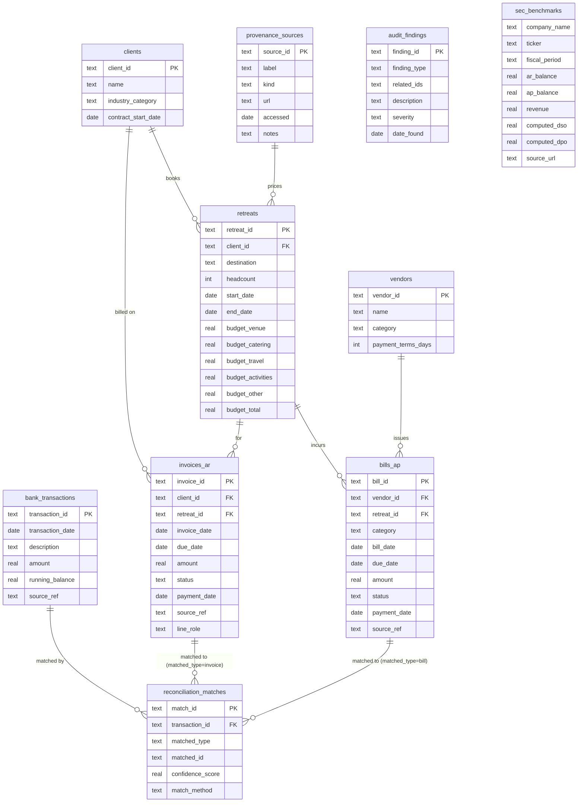

# Backend Schema — Retreat Finance Ops

**Status:** Draft for review
**Last updated:** 2026-09-10
**Related:** [TRD.md](TRD.md) · [PRD.md](PRD.md)
**Engine:** SQLite (file: `data/retreat_finance.db`). All access via SQLAlchemy Core; the
declarative models in `backend/models/` are a 1:1 mirror of the DDL below. Swapping to Postgres
is a connection-string change (TRD §2).

---

## 1. ER overview



> `reconciliation_matches.matched_id` is a **polymorphic** reference (to `invoices_ar.invoice_id`
> when `matched_type='invoice'`, else `bills_ap.bill_id`). SQLite can't express that as one FK,
> so it is enforced in application logic + a `CHECK` on `matched_type`. Documented as a
> deliberate tradeoff, not an oversight.

## 2. Tables

### 2.1 `clients`

| Column | Type | Constraints | Notes |
|--------|------|-------------|-------|
| `client_id` | TEXT | PK | e.g. `CLIENT_A` |
| `name` | TEXT | NOT NULL | anonymized label, e.g. `Client A` |
| `industry_category` | TEXT | NOT NULL | **real** category, e.g. `Streaming Media`, `Enterprise SaaS`, `Biotech` |
| `contract_start_date` | DATE | NOT NULL | first retreat booking date for this client |

No real company is ever stored as a client. Category is real; name is a label (PRD §8E).

### 2.2 `vendors`

| Column | Type | Constraints | Notes |
|--------|------|-------------|-------|
| `vendor_id` | TEXT | PK | e.g. `VEND_012` |
| `name` | TEXT | NOT NULL | anonymized, e.g. `Vendor 12 — Catering` |
| `category` | TEXT | NOT NULL, CHECK in (`venue`,`catering`,`travel`,`activities`,`other`) | drives budget-vs-actual grouping |
| `payment_terms_days` | INTEGER | NOT NULL, CHECK ≥ 0 | e.g. 15, 30 — used to derive `bills_ap.due_date` when the source record lacks one |

### 2.3 `retreats`

| Column | Type | Constraints | Notes |
|--------|------|-------------|-------|
| `retreat_id` | TEXT | PK | e.g. `RET_2011_014` |
| `client_id` | TEXT | NOT NULL, FK → `clients.client_id` | |
| `destination` | TEXT | NOT NULL | e.g. `Scottsdale, AZ` |
| `headcount` | INTEGER | NOT NULL, CHECK 1..500 | drives per-head budget math |
| `start_date` | DATE | NOT NULL | |
| `end_date` | DATE | NOT NULL, CHECK ≥ `start_date` | |
| `budget_venue` | REAL | NOT NULL ≥ 0 | from cited pricing (C) × nights |
| `budget_catering` | REAL | NOT NULL ≥ 0 | from cited per-head pricing × headcount × days |
| `budget_travel` | REAL | NOT NULL ≥ 0 | from GBTA per-trip figure × headcount |
| `budget_activities` | REAL | NOT NULL ≥ 0 | from cited per-head activity pricing × headcount |
| `budget_other` | REAL | NOT NULL ≥ 0 | contingency / AV / misc |
| `budget_total` | REAL | NOT NULL ≥ 0 | **stored**, and CHECK’d ≈ sum of the five (±$1) by the pipeline |

Provenance for each budget line is recorded in `retreat_budget_provenance` (§2.10).

### 2.4 `invoices_ar`

| Column | Type | Constraints | Notes |
|--------|------|-------------|-------|
| `invoice_id` | TEXT | PK | |
| `client_id` | TEXT | NOT NULL, FK → `clients.client_id` | |
| `retreat_id` | TEXT | NOT NULL, FK → `retreats.retreat_id` | |
| `invoice_date` | DATE | NOT NULL | **real** date from source A |
| `due_date` | DATE | NOT NULL | `invoice_date` + client terms (net-30/45) |
| `amount` | REAL | NOT NULL | **real** amount from source A, unchanged |
| `status` | TEXT | NOT NULL, CHECK in (`open`,`paid`,`partial`,`void`) | `void` preserves source cancellations/credit notes |
| `payment_date` | DATE | NULL | set only if settled on/before the build's as-of date; else NULL. Future/estimated collection dates are re-derived by the forecast logic, not stored. |
| `source_ref` | TEXT | NOT NULL | e.g. `UCI_OR2:invoice=536365;cust=17850` — the raw record this was built from (PRD SC-3); `;cancellation` / `;addon` suffixes flag the sub-type |
| `line_role` | TEXT | NULL, CHECK in (`deposit`,`final`,`addon`) | each retreat has a **deposit** invoice and a **final** invoice as separate AR line items (own dates/due/status); `addon` covers change-orders and credit notes |

### 2.5 `bills_ap`

| Column | Type | Constraints | Notes |
|--------|------|-------------|-------|
| `bill_id` | TEXT | PK | |
| `vendor_id` | TEXT | NOT NULL, FK → `vendors.vendor_id` | |
| `retreat_id` | TEXT | NOT NULL, FK → `retreats.retreat_id` | |
| `category` | TEXT | NOT NULL, CHECK in (`venue`,`catering`,`travel`,`activities`,`other`) | denormalized from vendor for fast group-by |
| `bill_date` | DATE | NOT NULL | real |
| `due_date` | DATE | NOT NULL | `bill_date` + `vendor.payment_terms_days` |
| `amount` | REAL | NOT NULL | real, unchanged |
| `status` | TEXT | NOT NULL, CHECK in (`open`,`paid`,`partial`,`void`) | |
| `payment_date` | DATE | NULL | real if present |
| `source_ref` | TEXT | NOT NULL | e.g. `BERKA:trans_id=...` or `UCI_OR2:...` depending on which source feeds AP |

### 2.6 `bank_transactions`

| Column | Type | Constraints | Notes |
|--------|------|-------------|-------|
| `transaction_id` | TEXT | PK | |
| `transaction_date` | DATE | NOT NULL | **real** (Berka) |
| `description` | TEXT | NOT NULL | **real** messy text (operation + k_symbol, or UCI counterparty) — kept as-is for fuzzy matching |
| `amount` | REAL | NOT NULL | real; sign convention: credits +, debits − |
| `running_balance` | REAL | NULL | **real** Berka balance where available |
| `source_ref` | TEXT | NOT NULL | raw record key |

### 2.7 `reconciliation_matches`

| Column | Type | Constraints | Notes |
|--------|------|-------------|-------|
| `match_id` | TEXT | PK | |
| `transaction_id` | TEXT | NOT NULL, FK → `bank_transactions.transaction_id` | |
| `matched_type` | TEXT | NOT NULL, CHECK in (`invoice`,`bill`) | |
| `matched_id` | TEXT | NOT NULL | polymorphic (see §1 note); app-enforced FK |
| `confidence_score` | REAL | NOT NULL, CHECK 0..100 | from `logic/reconcile.py` |
| `match_method` | TEXT | NOT NULL | e.g. `exact_amount+date`, `tol_amount+date+name`, `manual` |

This table is **materialized by the pipeline** at default tolerance for the Excel model and the
default UI load. The API can also compute matches on the fly for non-default tolerances (TRD §4)
without writing here.

### 2.8 `audit_findings`

| Column | Type | Constraints | Notes |
|--------|------|-------------|-------|
| `finding_id` | TEXT | PK | |
| `finding_type` | TEXT | NOT NULL, CHECK in (`duplicate`,`stale_90plus`,`unexplained_txn`,`double_payment`) | |
| `related_ids` | TEXT | NOT NULL | JSON array of ids (invoice/bill/txn) as text |
| `description` | TEXT | NOT NULL | human-readable, references the real values |
| `severity` | TEXT | NOT NULL, CHECK in (`low`,`medium`,`high`) | |
| `date_found` | DATE | NOT NULL | pipeline run date |

Every finding's `related_ids` resolve to rows whose `source_ref` points at a real raw record
(PRD SC-3). Findings are generated, never planted.

### 2.9 `sec_benchmarks`

| Column | Type | Constraints | Notes |
|--------|------|-------------|-------|
| `company_name` | TEXT | NOT NULL | e.g. `Global Business Travel Group` |
| `ticker` | TEXT | NOT NULL | `GBTG` |
| `fiscal_period` | TEXT | NOT NULL | e.g. `FY2024` |
| `ar_balance` | REAL | NOT NULL | reported, USD |
| `ap_balance` | REAL | NOT NULL | reported, USD |
| `revenue` | REAL | NOT NULL | reported, USD |
| `computed_dso` | REAL | NOT NULL | `ar_balance / revenue * 365` |
| `computed_dpo` | REAL | NOT NULL | `ap_balance / revenue * 365` (revenue proxy — TRD NFR-4) |
| `source_url` | TEXT | NOT NULL | EDGAR `companyconcept` URL(s) |

PK: composite (`ticker`, `fiscal_period`).

### 2.10 `provenance_sources` and `retreat_budget_provenance`

`provenance_sources` — the machine mirror of DATA_NOTES.md (TRD NFR-3):

| Column | Type | Constraints | Notes |
|--------|------|-------------|-------|
| `source_id` | TEXT | PK | e.g. `SRC_UCI_OR2`, `SRC_PEERSPACE_VENUE` |
| `label` | TEXT | NOT NULL | display name |
| `kind` | TEXT | NOT NULL, CHECK in (`dataset`,`pricing`,`benchmark`) | |
| `url` | TEXT | NOT NULL | |
| `accessed` | DATE | NOT NULL | access/download date |
| `notes` | TEXT | NULL | licence, what's real vs relabeled |

`retreat_budget_provenance` — links each retreat budget line to the price source used:

| Column | Type | Constraints |
|--------|------|-------------|
| `retreat_id` | TEXT | NOT NULL, FK → `retreats.retreat_id` |
| `category` | TEXT | NOT NULL, CHECK in (`venue`,`catering`,`travel`,`activities`,`other`) |
| `source_id` | TEXT | NOT NULL, FK → `provenance_sources.source_id` |
| `basis` | TEXT | NOT NULL | e.g. `$617/hr × 8h × 3d` |

PK: (`retreat_id`, `category`).

## 3. Indexing

Query patterns come from the API (TRD §4): aging filters on due date + status; AR/AP lists
filter by client/vendor/category/date; reconciliation scans by date and amount.

```sql
CREATE INDEX ix_ar_due_status      ON invoices_ar (due_date, status);
CREATE INDEX ix_ar_client          ON invoices_ar (client_id);
CREATE INDEX ix_ar_retreat         ON invoices_ar (retreat_id);
CREATE INDEX ix_ap_due_status      ON bills_ap   (due_date, status);
CREATE INDEX ix_ap_vendor          ON bills_ap   (vendor_id);
CREATE INDEX ix_ap_category        ON bills_ap   (category);
CREATE INDEX ix_ap_retreat         ON bills_ap   (retreat_id);
CREATE INDEX ix_txn_date           ON bank_transactions (transaction_date);
CREATE INDEX ix_txn_amount         ON bank_transactions (amount);
CREATE INDEX ix_match_txn          ON reconciliation_matches (transaction_id);
CREATE INDEX ix_match_target       ON reconciliation_matches (matched_type, matched_id);
```

At ~1k rows these are not performance-critical, but they are included because (a) they document
the intended access paths and (b) they make the Postgres migration behave identically.
`PRAGMA foreign_keys = ON;` is set on every connection.

## 4. DDL (this section is `data/schema.sql`)

```sql
PRAGMA foreign_keys = ON;

CREATE TABLE clients (
    client_id            TEXT PRIMARY KEY,
    name                 TEXT NOT NULL,
    industry_category    TEXT NOT NULL,
    contract_start_date  DATE NOT NULL
);

CREATE TABLE vendors (
    vendor_id           TEXT PRIMARY KEY,
    name                TEXT NOT NULL,
    category            TEXT NOT NULL CHECK (category IN ('venue','catering','travel','activities','other')),
    payment_terms_days  INTEGER NOT NULL CHECK (payment_terms_days >= 0)
);

CREATE TABLE retreats (
    retreat_id         TEXT PRIMARY KEY,
    client_id          TEXT NOT NULL REFERENCES clients(client_id),
    destination        TEXT NOT NULL,
    headcount          INTEGER NOT NULL CHECK (headcount BETWEEN 1 AND 500),
    start_date         DATE NOT NULL,
    end_date           DATE NOT NULL,
    budget_venue       REAL NOT NULL CHECK (budget_venue      >= 0),
    budget_catering    REAL NOT NULL CHECK (budget_catering   >= 0),
    budget_travel      REAL NOT NULL CHECK (budget_travel     >= 0),
    budget_activities  REAL NOT NULL CHECK (budget_activities >= 0),
    budget_other       REAL NOT NULL CHECK (budget_other      >= 0),
    budget_total       REAL NOT NULL CHECK (budget_total      >= 0),
    CHECK (end_date >= start_date)
);

CREATE TABLE invoices_ar (
    invoice_id    TEXT PRIMARY KEY,
    client_id     TEXT NOT NULL REFERENCES clients(client_id),
    retreat_id    TEXT NOT NULL REFERENCES retreats(retreat_id),
    invoice_date  DATE NOT NULL,
    due_date      DATE NOT NULL,
    amount        REAL NOT NULL,
    status        TEXT NOT NULL CHECK (status IN ('open','paid','partial','void')),
    payment_date  DATE,
    source_ref    TEXT NOT NULL,
    line_role     TEXT CHECK (line_role IN ('deposit','final','addon'))
);

CREATE TABLE bills_ap (
    bill_id       TEXT PRIMARY KEY,
    vendor_id     TEXT NOT NULL REFERENCES vendors(vendor_id),
    retreat_id    TEXT NOT NULL REFERENCES retreats(retreat_id),
    category      TEXT NOT NULL CHECK (category IN ('venue','catering','travel','activities','other')),
    bill_date     DATE NOT NULL,
    due_date      DATE NOT NULL,
    amount        REAL NOT NULL,
    status        TEXT NOT NULL CHECK (status IN ('open','paid','partial','void')),
    payment_date  DATE,
    source_ref    TEXT NOT NULL
);

CREATE TABLE bank_transactions (
    transaction_id    TEXT PRIMARY KEY,
    transaction_date  DATE NOT NULL,
    description       TEXT NOT NULL,
    amount            REAL NOT NULL,
    running_balance   REAL,
    source_ref        TEXT NOT NULL
);

CREATE TABLE reconciliation_matches (
    match_id          TEXT PRIMARY KEY,
    transaction_id    TEXT NOT NULL REFERENCES bank_transactions(transaction_id),
    matched_type      TEXT NOT NULL CHECK (matched_type IN ('invoice','bill')),
    matched_id        TEXT NOT NULL,
    confidence_score  REAL NOT NULL CHECK (confidence_score BETWEEN 0 AND 100),
    match_method      TEXT NOT NULL
);

CREATE TABLE audit_findings (
    finding_id    TEXT PRIMARY KEY,
    finding_type  TEXT NOT NULL CHECK (finding_type IN ('duplicate','stale_90plus','unexplained_txn','double_payment')),
    related_ids   TEXT NOT NULL,
    description   TEXT NOT NULL,
    severity      TEXT NOT NULL CHECK (severity IN ('low','medium','high')),
    date_found    DATE NOT NULL
);

CREATE TABLE sec_benchmarks (
    company_name   TEXT NOT NULL,
    ticker         TEXT NOT NULL,
    fiscal_period  TEXT NOT NULL,
    ar_balance     REAL NOT NULL,
    ap_balance     REAL NOT NULL,
    revenue        REAL NOT NULL,
    computed_dso   REAL NOT NULL,
    computed_dpo   REAL NOT NULL,
    source_url     TEXT NOT NULL,
    PRIMARY KEY (ticker, fiscal_period)
);

CREATE TABLE provenance_sources (
    source_id  TEXT PRIMARY KEY,
    label      TEXT NOT NULL,
    kind       TEXT NOT NULL CHECK (kind IN ('dataset','pricing','benchmark')),
    url        TEXT NOT NULL,
    accessed   DATE NOT NULL,
    notes      TEXT
);

CREATE TABLE retreat_budget_provenance (
    retreat_id  TEXT NOT NULL REFERENCES retreats(retreat_id),
    category    TEXT NOT NULL CHECK (category IN ('venue','catering','travel','activities','other')),
    source_id   TEXT NOT NULL REFERENCES provenance_sources(source_id),
    basis       TEXT NOT NULL,
    PRIMARY KEY (retreat_id, category)
);

-- indexes per §3
```

## 5. Notes / decisions

- **Types.** SQLite has no real `DATE`; dates are stored as ISO-8601 `TEXT` (`YYYY-MM-DD`) so
  string comparison == chronological comparison. Money is `REAL`; all comparisons in logic use a
  cent tolerance. (A Postgres port would use `date` and `numeric(14,2)`.)
- **No `updated_at` / soft-delete.** The DB is rebuilt wholesale by the pipeline; row history is
  not a v1 concern.
- **`status` vs `payment_date`.** `payment_date IS NULL` ⇔ `status='open'` (or `partial`). The
  pipeline enforces this invariant; `test_crosscheck.py` asserts it.
- **`source_ref` everywhere.** Non-negotiable — it is what makes PRD SC-3 (traceable findings)
  and SC-5 (provenance ≤ 2 clicks) true at the row level.
- **Two AR line items per retreat.** A `deposit` invoice (raised at booking) and a `final`
  invoice (raised just after the retreat), each with its own `invoice_date`, `due_date`,
  `status`, and `payment_date` — so aging and reconciliation get two real payment events per
  retreat, not one lump. `addon` covers change-orders and credit notes. Each line's `amount` is
  an independent real UCI invoice total (scaled); the deposit/final split therefore reflects
  real invoice sizes rather than a hardcoded 50/50.
- **Polymorphic `matched_id`.** Chosen over two nullable FK columns (`matched_invoice_id`,
  `matched_bill_id`) to keep the reconciliation output shape symmetric with the logic layer's
  `Match` dataclass. Integrity enforced in `logic/` + tests.
