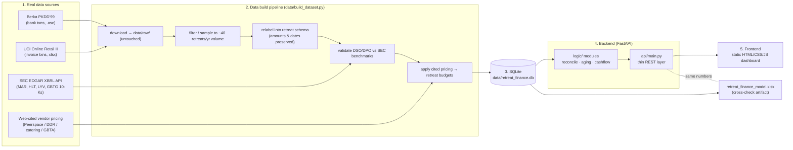

# TRD — Retreat Finance Ops

**Status:** Draft for review
**Last updated:** 2026-09-10
**Related:** [PRD.md](PRD.md) · [SCHEMA.md](SCHEMA.md) · [UIUX_SPEC.md](UIUX_SPEC.md)

---

## 1. System overview

Five stages, one direction of data flow:



- **Sources** are downloaded once and stored untouched in `data/raw/`.
- **Pipeline** is a single script that is safe to re-run; it rebuilds the DB deterministically.
- **SQLite** is the only runtime data store. The backend never re-reads the raw files.
- **Backend** = pure-Python logic modules (unit-testable, no web framework imported) + a thin
  FastAPI layer that only parses query params, calls a logic function, and serializes the result.
- **Frontend** is static files. No build step. Talks to the backend over `fetch`.
- **Excel model** is generated from the same SQLite DB and is a *verification artifact*: its
  numbers must equal the API's (PRD SC-2).

## 2. Tech stack & rationale

| Layer | Choice | Why (for a solo portfolio project) |
|-------|--------|------------------------------------|
| Language | Python 3.11+ | Matches my other finance/quant projects; one language across pipeline, logic, tests. |
| API framework | FastAPI | Type-hinted, automatic OpenAPI docs at `/docs` for reviewers, trivial to run (`uvicorn`). Consistent with the REST style of my Options Pricing Engine. |
| Storage | SQLite (file) | Data is ~1k rows total. No server to run. `sqlite3` is in the stdlib. TRD note: all DB access goes through SQLAlchemy Core, so swapping to Postgres is a connection-string change, not a rewrite. |
| ORM / query | SQLAlchemy 2.x (Core + lightweight declarative models) | Portable SQL, parameter binding, and the Postgres escape hatch above. Models double as the documented schema (SCHEMA.md). |
| Analytics | pandas | Aging buckets, forecast pivots, budget-vs-actual group-bys are all naturally DataFrame ops. |
| Fuzzy matching | rapidfuzz | Fast C++ Levenshtein/token-set ratio for matching messy bank descriptions to counterparty names. MIT-licensed, no native build headaches. |
| Excel model | XlsxWriter (write) | Native charts, conditional formatting, formulas, frozen panes. openpyxl is a fallback for reading back / assertions in tests. |
| HTTP client (pipeline) | requests | SEC EDGAR calls; simple, sets the required `User-Agent`. |
| Frontend | Vanilla HTML + CSS + ES modules | No framework, no bundler, no `node_modules`. Deploys as flat files to GitHub Pages. Consistent with my existing project style. Charts drawn with a single small charting lib loaded from CDN (see §6). |
| Tests | pytest | Matches my other projects. Logic tests and API tests split into separate files. |
| Deploy | Render (backend) + GitHub Pages (frontend) via GitHub Actions | Same pattern as my Options Pricing Engine. `render.yaml` blueprint; Pages workflow. |

Explicitly rejected: Postgres/MySQL (overkill at this scale), React/Vue/Svelte (build step, deps,
scope creep for one dashboard), Docker for local dev (adds friction; `pip install -r` + two
commands is enough), Alembic migrations (schema is created once by the pipeline; documented in
SCHEMA.md; a v2 concern).

## 3. Repository layout

Per PRD Section 7 of the brief. Key module boundaries:

```
backend/
  api/main.py         # FastAPI app: routing + serialization ONLY
  models/             # SQLAlchemy models = SCHEMA.md in code
  db.py               # engine/session factory, get_db() dependency
  config.py           # ReconConfig defaults, settings from env
  logic/
    reconcile.py      # match(bank_df, ledger_df, cfg) -> ReconResult   (no FastAPI import)
    aging.py          # age(ledger_df, as_of) -> AgingResult
    cashflow.py       # forecast(ar_df, ap_df, start_cash, weeks=13) -> ForecastResult
    audit.py          # find_findings(...) -> list[Finding]
    benchmarks.py     # load sec_benchmarks, expose ranges
  tests/
    test_reconcile.py test_aging.py test_cashflow.py test_api.py
```

The rule from my Options Pricing Engine carries over: **route handlers contain no business
logic.** A handler is: read query params → build a `ReconConfig` (or date) → call one
`logic/` function → return its dataclass as JSON. Everything testable without HTTP.

## 4. API design

Base path `/api`. All responses JSON. All list endpoints support `limit`/`offset`.
Read-only except where noted. Every response envelope includes a `provenance` block
(see §7) so source attribution survives from the data layer to the UI.

| Method | Path | Query params | Returns |
|--------|------|--------------|---------|
| GET | `/api/health` | — | `{status, db_rows, data_as_of}` — also used by frontend to detect cold start (§9). |
| GET | `/api/dashboard/summary` | `as_of?` | headline metrics: `ar_outstanding`, `ap_outstanding`, `dso`, `dpo`, `cash_position`, `overdue_invoice_count`, `budget_variance_total`, plus `benchmark` ranges for DSO/DPO. |
| GET | `/api/invoices` | `status?`, `client_id?`, `date_from?`, `date_to?`, `bucket?` (`0-30`…`90+`), `sort?`, `limit?`, `offset?` | AR rows with computed `days_overdue`, `aging_bucket`, `status`. |
| GET | `/api/bills` | `status?`, `vendor_id?`, `category?`, `date_from?`, `date_to?`, `bucket?`, `sort?`, `limit?`, `offset?` | AP rows, same shape. |
| GET | `/api/aging/ar` | `as_of?` | `{as_of, buckets:[{bucket,count,amount}], total, dso}`. |
| GET | `/api/aging/ap` | `as_of?` | same shape with `dpo`. |
| GET | `/api/cashflow/forecast` | `start_cash?`, `weeks?` (default 13), `as_of?` | `{weeks:[{week_start, expected_collections, scheduled_payments, net, ending_balance}], assumptions}`. |
| GET | `/api/reconciliation/report` | `amount_tol_pct?`, `amount_tol_abs?`, `date_window_days?`, `min_name_score?` | `{config, matched:[…], unmatched_bank:[…], unmatched_ledger:[…], stats:{match_rate,…}}`. Each `matched` item has `confidence`, `match_method`, `reasons[]`. |
| GET | `/api/reconciliation/exceptions/{txn_id}` | same tolerance params | the single transaction with its top-N candidate matches and per-candidate score breakdown (amount delta, date delta, name score) — powers the "why didn't this match" panel (US-6). |
| GET | `/api/audit/findings` | `severity?`, `type?` | `[{finding_id, finding_type, severity, description, related_ids, date_found, source_refs[]}]`. |
| GET | `/api/retreats` | `client_id?` | retreat list with `budget_total`, `actual_total`, `variance_pct`, `over_budget`. |
| GET | `/api/retreats/{id}/budget-vs-actual` | — | per-category `{category, budget, actual, variance_abs, variance_pct, over_10pct}` + retreat meta + the cited price sources behind each budget line. |
| GET | `/api/benchmarks` | — | `sec_benchmarks` rows (company, period, AR, AP, revenue, DSO, DPO, `source_url`). |
| GET | `/api/provenance` | — | the full source manifest (mirrors DATA_NOTES.md) for the UI provenance panel. |

Reconciliation tolerance is **only** ever passed in as query params with documented defaults in
`backend/config.py` (`ReconConfig`): `amount_tol_pct=1.0`, `amount_tol_abs=5.00`,
`date_window_days=30`, `min_name_score=45`, `accept_score=60`, score weights
`amount/date/name = 0.50/0.20/0.30`. Nothing tolerance-related is hardcoded in `reconcile.py`.

> **`date_window_days` = 30, revised up from the 5 sketched earlier in this doc.** Matching
> anchors on the ledger row's **due date** (the only date an analyst has *before* reconciling).
> Real payments land from a few days early to ~4 weeks late on net-15..45 terms, so a tight
> window around the due date structurally misses most legitimately-late vendor payments.
> Measured on the shipped dataset, ground-truth recall vs. window: ±5d → **20%**, ±10d → **48%**,
> ±15d → **74%**, ±20d → **87%**, ±30d → **97.5%** (precision rises in step, 81% → 99.5%). The
> date component of the score still rewards closer dates within the window, and the UI exposes
> the parameter so an analyst can tighten it.

CORS: backend allows the GitHub Pages origin + `localhost` dev origins, `GET` only.

## 5. Data pipeline (`data/build_dataset.py`)

Ordered, idempotent, fixed seed (`RANDOM_SEED = 42`):

1. **Acquire** — download A/B if absent; write to `data/raw/` and never modify. SEC (D) pulled
   live via EDGAR XBRL `companyconcept` endpoints; raw JSON cached to `data/raw/sec/`.
2. **Load** — read raw A into a line-item DataFrame; collapse to invoice level (sum line amounts,
   keep first date, keep cancellation flag). Read raw B transactions.
3. **Sample** — filter to a window and sample to target volume: **80–150 AR invoices**,
   **300–400 AP bills**, bank transactions of comparable count. Sampling preserves the natural
   distribution of amounts, gaps, and anomaly rate (stratified by amount decile).
4. **Relabel** — assign `client_id`, `retreat_id`, `vendor_id`, `category` to each record.
   **Dollar amounts, dates, and anomalies are copied through unchanged.** Only labels are added.
   Each output row keeps `source_ref` = the raw record key it came from.
5. **Budgets** — build `retreats.budget_*` from the cited vendor pricing (C) × each retreat's
   headcount / nights. Every budget line records its `price_source` URL + access date.
6. **Validate** — compute AR aging, AP aging, DSO, DPO on the sampled set. Compare to the SEC
   benchmark ranges (D). If DSO or DPO falls outside the real range, re-sample (up to N tries)
   and record the outcome in `DATA_NOTES.md`. If it still can't be brought in range, document
   the residual and why.
7. **Persist** — create the SQLite schema (SCHEMA.md) and load all tables. Write
   `data/sec_benchmarks.csv` and append the run summary to `DATA_NOTES.md`.

## 6. Frontend

- Three files: `frontend/index.html`, `style.css`, `app.js` (ES modules OK, no bundler).
- One charting dependency loaded from CDN (Chart.js or uPlot) — pinned version, documented,
  with graceful degradation to a table if it fails to load.
- `app.js` has a single `API_BASE` constant (localhost in dev, Render URL in prod build).
- No state library; a small module-level `state` object + explicit `render()` functions.
- Detail in [UIUX_SPEC.md](UIUX_SPEC.md).

## 7. Non-functional requirements

- **NFR-1 Performance.** All data fits in memory; every endpoint should respond in **< 150 ms**
  locally (p95), **< 800 ms** on Render free tier when warm. No pagination needed for
  correctness, only for UI tidiness.
- **NFR-2 Configurable matching.** Tolerances are request params with defaults in `config.py`.
  The UI gear control (UIUX_SPEC) sets them per request; changing them re-runs reconciliation
  against the same data with no server state change.
- **NFR-3 Provenance is not lost.** Every API response that contains money carries a
  `provenance` array of `{field, source, url, accessed}` entries. `build_dataset.py` writes a
  `provenance` table in SQLite; the API reads it; the UI renders it in a footer panel and in
  per-retreat budget rows. DATA_NOTES.md is the human-readable master; the DB table is its
  machine mirror and they are generated together.
- **NFR-4 DSO/DPO basis.** DSO = AR_outstanding / (trailing-12-month billed AR) × 365.
  DPO = AP_outstanding / (trailing-12-month AP) × 365. Revenue is used as the DPO denominator
  proxy for the SEC benchmarks too (no `CostOfRevenue` XBRL tag is filed by MAR/HLT/LYV/GBTG);
  this proxy is stated everywhere DPO appears.
- **NFR-5 Determinism.** Fixed seed; a clean rebuild is byte-stable for the DB content.
- **NFR-6 No secrets.** SEC API needs only a descriptive `User-Agent`. Nothing else needs auth.
- **NFR-7 Error surface.** API returns structured `{error, detail}` with correct status codes;
  the frontend shows a non-blocking banner and falls back to the last good render.

## 8. Testing approach

Following the pytest conventions from my other projects — **model-logic tests are separate from
API tests**, and API tests mock the data layer.

| File | Scope | Notes |
|------|-------|-------|
| `test_reconcile.py` | `logic/reconcile.py` | hand-built tiny frames: exact match, within-tolerance match, out-of-tolerance rejection, date-window enforcement, polarity (receipt↔invoice / payment↔bill), fuzzy-name disambiguation of equal amounts, ambiguity → confidence haircut, one-bank-line↔one-ledger-row, explain-panel near-miss verdict, unexplained-when-no-candidate. **Integration:** runs the engine on the shipped DB and asserts `score_against_ground_truth(...)["recall_pct"] ≥ 85` against the `reconciliation_matches` table (PRD SC-1), plus precision ≥ 95, zero noise false-positives, all 3 injected double-payments flagged, and every finding's `related_ids` resolve to real rows. |
| `test_aging.py` | `logic/aging.py` | boundary dates (exactly 30 / 31 / 90 / 91 days), as-of in the past, zero-balance ledger, all-overdue ledger. Assert bucket sums == total. |
| `test_cashflow.py` | `logic/cashflow.py` | known AR/AP with fixed due dates → assert each weekly `net` and `ending_balance`; assert week 0 starts from `start_cash`; 13 weeks always returned. |
| `test_audit.py` | `logic/audit.py` | planted-in-fixture duplicate / 90+ stale / unexplained txn → assert each is found once, with correct `related_ids`. |
| `test_api.py` | `api/main.py` | FastAPI `TestClient`; `logic/` functions and the DB session are monkeypatched/mocked. Assert status codes, response shape, query-param plumbing (e.g. `bucket=61-90` reaches the logic call), and that `provenance` is present on money endpoints. No real DB. |

`test_crosscheck.py` (integration, not mocked): builds a small DB, runs the logic, opens the
generated `.xlsx` with openpyxl, asserts the tab values equal the API values (PRD SC-2).

CI: GitHub Actions runs `pytest` + `ruff` on push.

## 9. Deployment

Same pattern as the Options Pricing Engine:

- **Backend → Render** via `render.yaml` blueprint: Python env, `pip install -r requirements.txt`,
  start `uvicorn backend.api.main:app`. SQLite DB is committed (it's small and deterministic) so
  the service has data on boot; a Render build hook can re-run `build_dataset.py` if raw inputs
  change.
- **Frontend → GitHub Pages** via a Pages Actions workflow that publishes `frontend/` on push to
  `main`, injecting the production `API_BASE`.
- **CORS:** backend `allow_origins` = the Pages URL + `http://localhost:*`. Methods: `GET`,
  `OPTIONS`.
- **Cold start:** Render free tier sleeps after inactivity; first request can take 30–60 s. The
  frontend calls `/api/health` on load and, if it doesn't answer within ~2 s, shows a
  "backend is waking up…" state with a spinner and retry/backoff — exactly as done on the
  Options Pricing Engine — instead of showing a broken dashboard.
- **Config:** `API_BASE`, `ALLOWED_ORIGINS`, `START_CASH` default via env vars; documented in
  README.

## 10. Risks / mitigations

| Risk | Mitigation |
|------|-----------|
| Source site (Peerspace etc.) changes prices after citation | DATA_NOTES.md records the price **and access date**; screenshots/quotes captured into `data/raw/pricing/`. |
| SEC tag coverage varies by filer (already hit: no `CostOfRevenue`) | Use documented proxy denominator; benchmark logic tolerates missing tags and records which were unavailable. |
| Sampled data won't fall in benchmark DSO/DPO range | `build_dataset.py` re-samples with new seed offset up to N times; residual documented, not hidden. |
| Berka / UCI amounts are not USD | Relabel 1:1, disclose in DATA_NOTES.md and in the UI provenance panel; multi-currency explicitly out of scope. |
| Fuzzy matching over-matches on generic descriptions | Require amount **and** date **and** name score together; ambiguous candidates lower the confidence and route to the exception list rather than auto-matching. |
